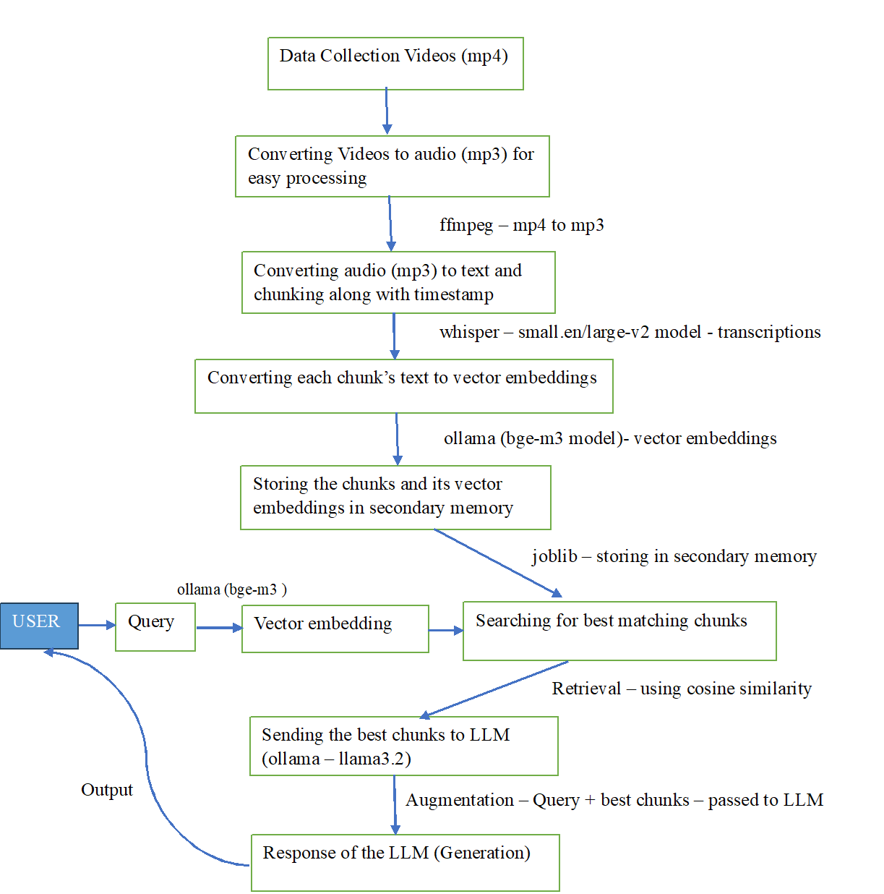

\# RAG-based Question Answering System

\## Overview

This project implements a Retrieval-Augmented Generation (RAG) pipeline

that answers user queries using video transcripts and semantic search.

\## RAG Pipeline Architecture

\## Technologies Used

\- Python

\- Whisper (speech-to-text)

\- Ollama (bge-m3, llama3.2)

\- Vector embeddings

\- Cosine similarity

\- Joblib

\## Workflow

1\. Convert video to audio using ffmpeg

2\. Transcribe audio with timestamps using Whisper

3\. Chunk text and generate embeddings

4\. Store embeddings in secondary storage

5\. Retrieve relevant chunks using similarity search

6\. Generate final answer using LLM

